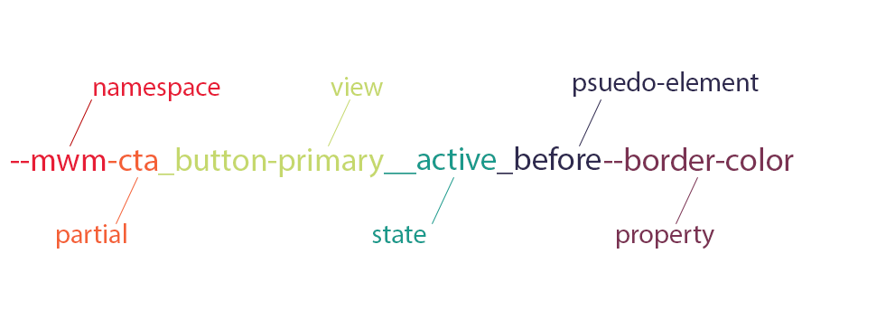

[MWM](README.md) > CSS Variable Naming Conventions

:warning: **DEPRECATED** This naming convention is no longer recommended. Please refer to the latest [themes](./themes.md) documentation for current best practices.

TODO: Copy any useful examples from this page to the updated themes documentation and remove this page.

# CSS Variable Naming Conventions

## Naming Convention

`--[namespace]-[partial]_[view]__[state]_[psuedo-element]--[property]`

Keywords within parenthesis along with their preceeding separator can be omitted if not relevant to the variable.

Refer to the following diagram to get a better idea of the naming flow. In this diagram, each color coded section can be ommitted or added as needed.

[Link to CSS variable naming diagram](./images/css-variable-naming.png)

## Namespace

The namespace should always be relevant to the project. In this case the namespace will always be `mwm`.

## Partial

_Default: theme_

The name of the partial attached to this style change. If no partial is related to this variable, the default `theme` can be used. Also, the `palette` keyword is sometimes used when setting variables within the context of our color palette system.

## View

_Optional_

If the view is default or if the variable is associated with the entire partial/module, this keyword should be omitted. Otherwise, the name of the view's folder should be used.

## State

_Optional_

If the variable targets a specific element state (e.g. focus, active, hover, etc...) use this keyword to signify that state.

## Pseudo-element

_Optional_

If this variable targets a pseudo-element (e.g. before, after), specify it with this keyword.

## Property

This keyword specifies the CSS property that uses this variable. For example, the color css property and the background-color css property could be defined differently.
